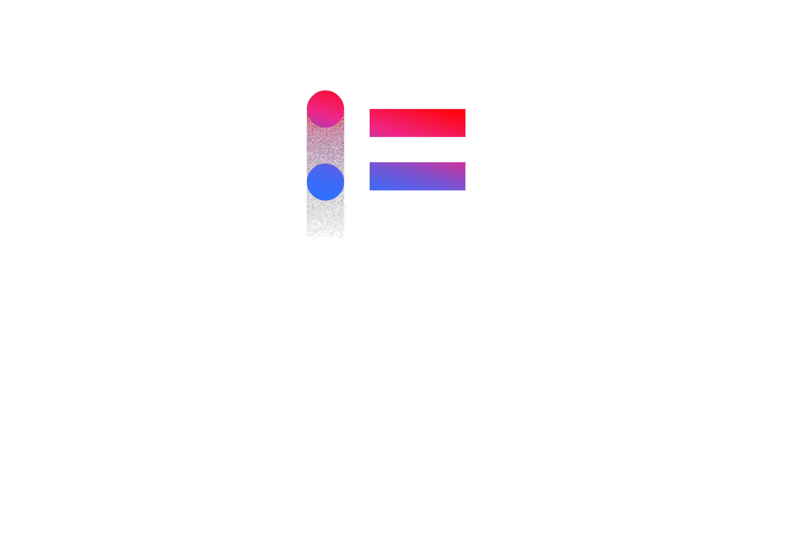

<p align="center">
  
</p>

<h1 align="center">AI Model Providers Comparison</h1>

<p align="center">
  <strong>Live, interactive dashboard comparing throughput, pricing, capabilities, and recommendations across frontier AI models.</strong>
</p>

<p align="center">
  <a href="https://ai-driven-office.github.io/model-providers-comparison/">Live Site</a> ·
  <a href="#adding-a-model">Add a Model</a> ·
  <a href="https://github.com/ai-driven-office/model-providers-comparison/issues">Report Issue</a>
</p>

---

## Why This Exists

Choosing the right AI model is hard. Pricing pages are scattered across a dozen providers, throughput benchmarks live in blog posts that go stale in weeks, and capability comparisons are usually vibes-based. We wanted a single page where an engineer can glance at the data and make an informed decision — fast.

This dashboard is maintained by the **AI Driven Office** (AIドリブン推進室) at **CyberAgent, Inc.** and is updated as new models and pricing data become available.

## What You Get

| Tab | What it shows |
|---|---|
| **Throughput** | Tokens-per-second bar chart — who's fastest? |
| **Pricing** | Input/output cost per million tokens, including >200K context pricing where available |
| **Speed vs Cost** | Scatter plot — bottom-right quadrant is the sweet spot (fast *and* cheap) |
| **Abilities** | Radar + table of normalized 0–100 scores across Planning, Coding, Vision, Research, Creative |
| **Picks** | Opinionated recommendations ranked by raw quality, cost-efficiency (score ÷ price), and speed (score × throughput) |

Everything is bilingual — toggle between **English** and **日本語** in real-time. Yen prices are auto-converted at ¥150/$.

## Providers Tracked

OpenAI · Anthropic · Google (AI Studio & Vertex) · xAI · Cerebras · SiliconFlow · Alibaba Cloud · Moonshot · Inception · Taalas

## Tech Stack

| Layer | Choice | Why |
|---|---|---|
| Framework | [Astro v5](https://astro.build) | Static-first, ships zero JS for non-interactive pages, view transitions |
| Islands | [React 19](https://react.dev) | Interactive charts hydrate on demand via `client:load` / `client:only` |
| Charts | [Recharts 3](https://recharts.org) | Composable, responsive, plays well with React |
| Styling | [Tailwind CSS v4](https://tailwindcss.com) | Utility-first via `@tailwindcss/vite` plugin — no config file needed |
| Animations | [Motion](https://motion.dev) + CSS | Framer Motion for the Picks panel; CSS keyframes + `::view-transition` for everything else |
| Shaders | [@paper-design/shaders-react](https://github.com/paper-design/shaders) | GPU mesh gradients for ambient background glow (respects `prefers-reduced-motion`) |
| Sound | Web Audio API | Synthesized sci-fi UI sounds — layered oscillators, filter sweeps, no audio files |
| OG Image | [Satori](https://github.com/vercel/satori) + [@resvg/resvg-js](https://github.com/nicolo-ribaudo/resvg-js) | Dynamic Open Graph image generation at build time |
| Icons | [Lucide React](https://lucide.dev) | Consistent icon set, tree-shakeable |
| Data | Astro Content Collections | YAML files validated at build time with Zod — type errors are build errors |
| Runtime | [Bun](https://bun.sh) | Fast installs, native TypeScript, used in CI |
| Deployment | GitHub Pages via GitHub Actions | Push to `main` → auto-deploy |

## Project Structure

```
src/
├── content/
│   ├── config.ts              # Zod schemas for all collections
│   ├── i18n/{en,ja}.yaml      # UI copy in both languages
│   ├── providers/*.yaml       # Provider metadata (name, color, URL)
│   └── models/*.yaml          # One file per model (name, tps, pricing, abilities)
├── components/
│   ├── ModelDashboard.tsx      # Main React island — tabs, hero cards, legend, CTA
│   ├── BoothSlideshow.tsx      # Full-screen kiosk mode for event booths
│   ├── GlmCerebrasGuide.tsx   # GLM × Cerebras setup guide page
│   └── ui/
│       ├── ThroughputChart.tsx # Bar chart — tokens/sec
│       ├── PricingChart.tsx    # Grouped bar chart — input/output $/M
│       ├── ScatterPlot.tsx     # Speed vs Cost scatter
│       ├── AbilityRadar.tsx    # Spider/radar chart for model capabilities
│       ├── AbilityTable.tsx    # Sortable table of ability scores
│       ├── ResultsPanel.tsx    # Recommendation cards with animated bars
│       ├── DataTable.tsx       # Raw data table with sorting
│       └── ProviderIcon.tsx    # Model & provider icon resolver
├── data/
│   ├── types.ts               # Shared TypeScript interfaces
│   ├── colors.ts              # Provider → color mapping
│   ├── i18n.ts                # Lang hook, currency formatting (USD ↔ JPY)
│   └── sfx.ts                 # Web Audio synthesized sound effects
├── layouts/
│   └── BaseLayout.astro       # HTML shell — SEO, OG tags, fonts, structured data
├── pages/
│   ├── index.astro            # Main dashboard
│   ├── glm-cerebras.astro     # GLM + Cerebras coding guide
│   └── booth.astro            # Kiosk slideshow for event displays
└── styles/
    └── global.css             # Tailwind v4 import, theme tokens, animations
```

## Quick Start

```bash
# Clone
git clone https://github.com/ai-driven-office/model-providers-comparison.git
cd model-providers-comparison

# Install (Bun recommended, npm/pnpm also work)
bun install

# Dev server at http://localhost:4321
bun run dev

# Production build → dist/
bun run build

# Preview production build
bun run preview

# Live TPS benchmark CLI
npm run benchmark:tps -- --models minimax-m2-5,qwen-3-5-397b --runs 2
```

## Live TPS Benchmark CLI

The repo includes a small CLI for measuring real streamed completion throughput against the current catalog rows.

```bash
# Fastest OpenRouter route where available, plus direct Cerebras for glm-4-7
npm run benchmark:tps -- --runs 1

# Narrow to a few rows and write JSON
npm run benchmark:tps -- --models gpt-5-4-pro,minimax-m2-5,glm-4-7 --out tmp/tps.json

# Patch measured medians back into src/content/models/*.yaml
npm run benchmark:tps -- --models minimax-m2-5,qwen-3-5-397b --write-tps
```

Required env vars:

- local `codex` CLI for the direct `gpt-5-3-codex-spark` preview path when available
- `OPENAI_API_KEY` for the direct `gpt-5-3-codex-spark` preview path on the OpenAI Responses API
- `OPENROUTER_API_KEY` for OpenRouter-backed models
- `CEREBRAS_API_KEY` for the direct `glm-4-7` Cerebras path

Notes:

- `gpt-5-3-codex-spark` tries local `codex exec -m gpt-5.3-codex-spark-preview` first, then the direct OpenAI Responses API, then OpenRouter if needed.
- The Codex CLI route reports end-to-end wall-clock TPS because Codex JSON mode exposes final usage but not token-by-token deltas.
- OpenRouter requests are pinned to the fastest provider route via `provider.sort = "throughput"` with fallbacks disabled.
- The CLI reports streamed completion TPS from first emitted token to last emitted token, plus TTFT and wall-clock TPS.
- Rows that are service tiers or lack a public benchmarkable API route are skipped with an explicit reason.

## Adding a Model

1. Create `src/content/models/your-model.yaml`:

```yaml
name: My New Model
provider: openai          # must match a filename in src/content/providers/
tps: 120
input: 2.50
output: 10
abilities:
  planning: 80
  coding: 85
  image: 70
  research: 75
  creative: 72
```

2. If the provider doesn't exist yet, create `src/content/providers/new-provider.yaml`:

```yaml
name: New Provider
color: "#6366F1"
url: https://newprovider.example.com
```

3. Run `bun run dev` — Astro validates against the Zod schema at build time. Type errors are caught immediately.

### Optional Fields

| Field | Type | Default | Description |
|---|---|---|---|
| `inputLong` | `number \| null` | `null` | >200K context input price ($/M tokens) |
| `outputLong` | `number \| null` | `null` | >200K context output price ($/M tokens) |
| `hero` | `boolean` | `false` | Feature as "Speed Champion" in the hero card |
| `hidden` | `boolean` | `false` | Exclude from all charts (useful for deprecated models) |
| `tag` | `string \| null` | `null` | Category tag (e.g. `"fast"`, `"flagship"`) |

## Design Decisions

**Why YAML, not a database?** Every model is a ~10-line file. Git diff is the audit log. PRs are the review process. No backend to maintain, no API keys to rotate.

**Why Astro islands?** The dashboard is a single interactive React component, but the shell (HTML, meta tags, structured data, fonts) is zero-JS static HTML. Best of both worlds.

**Why synthesized sound?** The UI sound effects are generated via Web Audio API oscillators — no audio files to load, sub-1KB total footprint. They layer square/sine/triangle waves with filter sweeps and detuning for a sci-fi feel. The effects toggle respects `prefers-reduced-motion` and persists the user's choice in `localStorage`.

**Why no SSR?** This is a read-only data dashboard. Static generation means instant loads from a CDN with zero server cost. The GitHub Actions pipeline builds and deploys on every push to `main`.

## Deployment

Pushes to `main` auto-deploy to GitHub Pages via the workflow in `.github/workflows/deploy.yml`.

**One-time setup:** In your GitHub repo → Settings → Pages → Source, select **"GitHub Actions"**.

The CI pipeline uses Bun with `--frozen-lockfile` for reproducible builds.

## Contributing

Found a wrong price? Missing model? Outdated benchmark score? **We'd love your help.**

- **Open an issue** for data corrections, feature requests, or questions
- **Send a pull request** to add models, update pricing, or improve the UI
- Model data lives in `src/content/models/*.yaml` — most contributions are a one-file change

Please keep PRs focused — one model or one fix per PR makes review fast.

## License

This project is open source under the MIT License. Data is sourced from provider documentation, [OpenRouter](https://openrouter.ai/), and public benchmarks such as [Artificial Analysis](https://artificialanalysis.ai/).

---

<p align="center">
  Built by <strong>AI Driven Office (AIドリブン推進室)</strong> at <a href="https://www.cyberagent.co.jp/">CyberAgent, Inc.</a>
</p>
